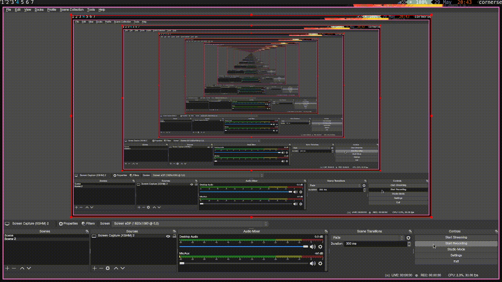
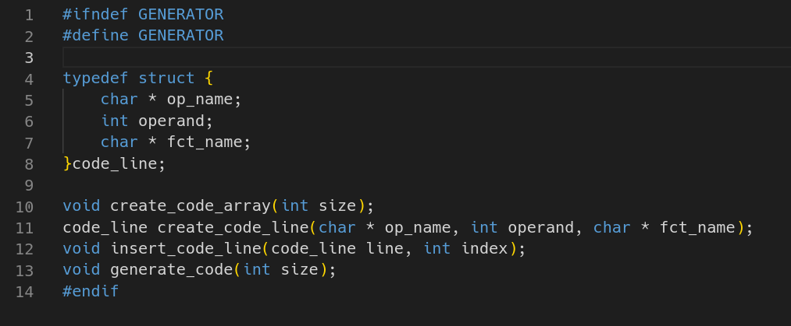
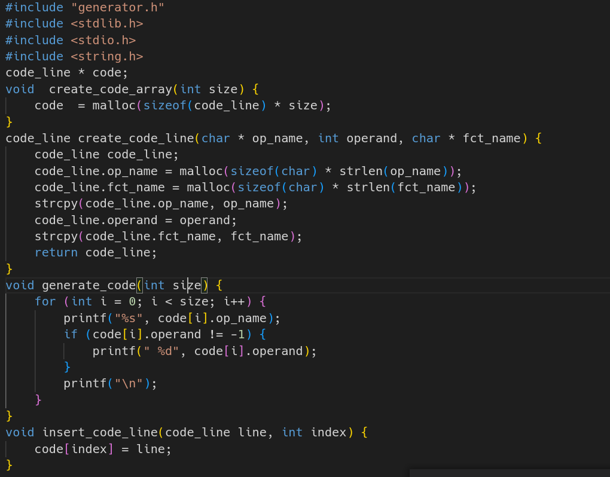
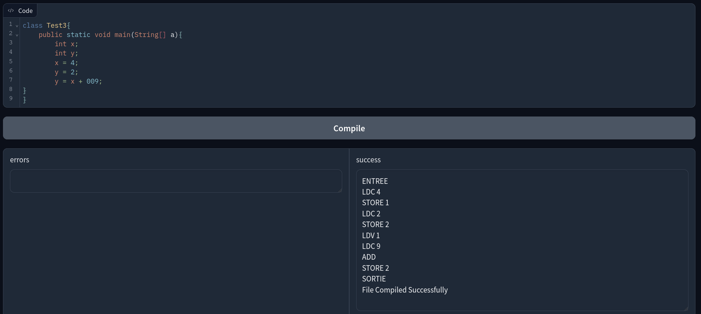
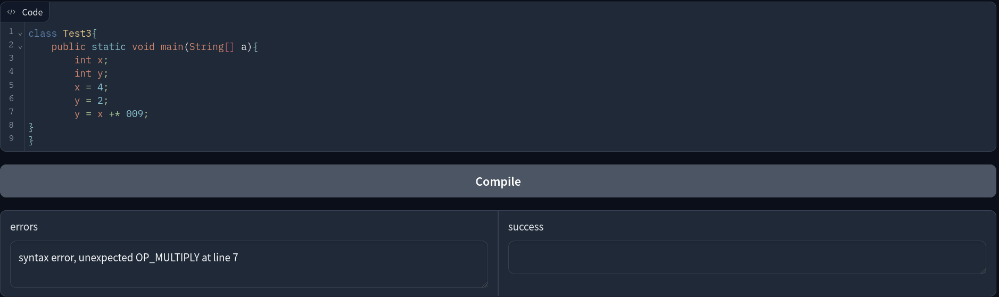

# Introduction

This project is a mini Java compiler using Flex for lexical analysis and Yacc that handles a subset of the java language.


# Setup
## compiling the compiler
```sh
flex javaComp.lex
bison -d javaComp.y  
gcc -o miniJavaCompiler javaComp.tab.c lex.yy.c
```
## launching the application

```sh
# install required packages
pip install gradio

# launch the web interface
cd server
gradio app.py
```

The application will be running on `http://127.0.0.1:7860`
  


# Demo
<p align="center">
  
</p>

# Code generation

The structure for the each instruction can be found in the `generator.h` file



methods for code generation and insertion can be found in the `generator.c` file




# Examples:


    
      




